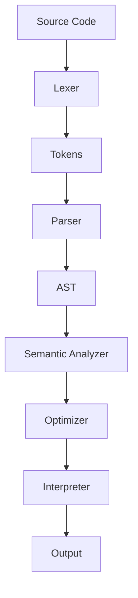

# Hinagpis / SadBoy CodeX Demonstration Script

Use this as your spoken guide when presenting the project.

## 1. Introduction

**Say:**

Good day everyone. Today I will demonstrate **Hinagpis**, also called **SadBoy CodeX**.
It is a custom programming language based on Tagalog and modern slang keywords.

This project shows the major parts of programming language development:

- **Lexical analysis**
- **Parsing**
- **Abstract Syntax Tree generation**
- **Semantic analysis**
- **Optimization**
- **Interpretation**
- **Error handling**
- **A multiline coding UI**

The main implementation is in `.\hinagpis.py`.

## 2. Show the Project Files

**Say:**

The important files are:

- **`.\hinagpis.py`**: The main language implementation.
- **`.\main.py`**: The command-line runner.
- **`.\hinagpis_ui.py`**: The multiline coding interface.
- **`.\demo.py`**: A demo runner.
- **`.\examples\`**: Sample programs written in Hinagpis.
- **`.\LANGUAGE_DESIGN.md`**: The unified guide and documentation.

## 3. Explain the Token Style

**Say:**

Hinagpis preserves the original SadBoy token names.
For example:

| Symbol or Keyword | Token |
|---|---|
| `kung` | `KUNG` |
| `o_else` | `WHATIF` |
| `gawa` | `GAWA` |
| `balikan` | `BALIKAN` |
| `+` | `DAGDAG` |
| `-` | `BAWAS` |
| `*` | `DAMAY` |
| `/` | `HATI` |

This means the language does not simply copy Python or JavaScript syntax.
It has its own identity and token system.

## 4. Run the Demo Script

**Do this in PowerShell:**

```powershell
cd C:\Users\HP\Documents\Codex\Prog-language
python .\demo.py
```

**Say:**

This command runs the built-in demo program.
It first shows the source code, validates it, and then executes it.

The program demonstrates:

- Function definition using `gawa`
- Return statements using `balikan`
- Conditional statements using `kung` and `o_else`
- Loops using `para` and `sa`
- Arithmetic operations
- Built-in printing

## 5. Show Lexer Tokens

**Do this:**

```powershell
python .\demo.py --tokens
```

**Say:**

This shows the lexical analyzer in action.
The lexer reads the source code character by character and converts it into tokens.

For example, when the lexer sees `gawa`, it returns the token `GAWA`.
When it sees `+`, it returns the token `DAGDAG`.

This proves that the program has a working lexical analyzer.

## 6. Run All Example Programs

**Do this:**

```powershell
python .\demo.py --all
```

**Say:**

Now I will run all example programs inside the `.\examples\` folder.
Each example focuses on a specific language feature:

- Variables and data types
- Arithmetic
- Conditionals
- While loops
- For loops and lists
- Functions and recursion
- List indexing
- A complete mini program

## 7. Run a Specific Program Manually

**Do this:**

```powershell
python .\main.py .\examples\06_functions_recursion.codex
```

**Say:**

This example demonstrates functions and recursion.
It defines a factorial function using `gawa` and returns values using `balikan`.

The interpreter executes the program and prints the result.

## 8. Validate Without Running

**Do this:**

```powershell
python .\main.py .\examples\08_complete_program.codex --ast
```

**Say:**

This command checks the program without executing it.
It confirms that the program can be tokenized, parsed, semantically checked, and optimized.

If the program is valid, it prints a success message.

## 9. Show Tokens for a File

**Do this:**

```powershell
python .\main.py .\examples\03_conditionals.codex --tokens
```

**Say:**

This command prints the tokens from a source file.
It is useful for debugging and for proving that the lexer recognizes the language syntax correctly.

## 10. Demonstrate the Multiline UI

**Do this:**

```powershell
python .\hinagpis_ui.py
```

**Say:**

This opens the multiline coding UI.
The UI allows the user to write Hinagpis code in an editor instead of typing one line at a time.

The UI supports:

- Multiline editing
- Running code
- Validating syntax and semantics
- Showing lexer tokens
- Opening `.codex` files
- Saving `.codex` files
- Viewing output and errors

## 11. UI Demo Steps

Inside the UI:

1. Click **Run** or press `F5`.
2. Show the output panel.
3. Click **Tokens** to show lexical analysis.
4. Click **Validate** to show syntax and semantic checking.
5. Modify the code slightly.
6. Run it again.

**Say:**

This UI makes the language easier to test because users can write full multiline programs.
It also helps with debugging because errors are shown in the output panel.

## 12. Explain the Language Pipeline

**Say:**

The program follows this language processing pipeline:



First, the lexer creates tokens.
Second, the parser checks grammar and creates an AST.
Third, the semantic analyzer checks variables and functions.
Fourth, the optimizer simplifies the program.
Finally, the interpreter executes it.

## 13. Show Error Handling

**Optional demo:**

Open the UI or edit an example and intentionally create an error:

```codex
print(unknown_variable)
```

**Say:**

This demonstrates semantic error handling.
The analyzer detects that `unknown_variable` was never defined and reports the problem.

Another example is division by zero:

```codex
print(10 / 0)
```

This demonstrates runtime error handling.

## 14. Closing Statement

**Say:**

To summarize, Hinagpis / SadBoy CodeX is a working custom programming language.
It supports variables, data types, arithmetic, conditionals, loops, functions, lists,
semantic validation, optimization, interpretation, and a multiline coding UI.

The project demonstrates the complete process of designing and implementing a programming language.

Thank you.

