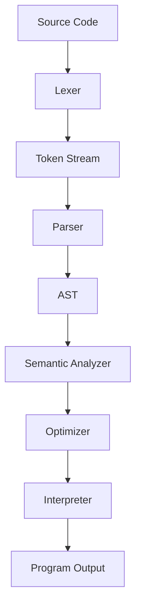

# CodeX Unified Language Guide

This file unifies the former language design, lexer documentation, project summary,
SadBoy guide, cheat sheet, and transformation notes into one reference.

## Table of Contents

1. [Project Overview](#project-overview)
2. [Language Pipeline](#language-pipeline)
3. [Syntax and Grammar](#syntax-and-grammar)
4. [Tokens and Lexer](#tokens-and-lexer)
5. [Parser and AST](#parser-and-ast)
6. [Semantic Analysis](#semantic-analysis)
7. [Interpreter](#interpreter)
8. [Optimization](#optimization)
9. [Error Handling and Debugging](#error-handling-and-debugging)
10. [SadBoy CodeX Keywords](#sadboy-codex-keywords)
11. [Examples](#examples)
12. [CLI Usage](#cli-usage)

## Project Overview

**CodeX** is an educational interpreted programming language. It supports:

- **Variables** with dynamic typing
- **Data types**: integers, floats, strings, booleans, lists, `null`, and functions
- **Arithmetic**: `+`, `-`, `*`, `/`, `//`, `%`, `^`
- **Comparison**: `==`, `!=`, `<`, `>`, `<=`, `>=`
- **Logic**: `and`, `or`, `not`
- **Conditionals**: `if` / `else`
- **Loops**: `while` and `for in`
- **Functions** with parameters and `return`
- **Built-ins**: `print`, `len`, `type`, and `input`
- **Original SadBoy tokens** using Tagalog / slang keyword names, with English keyword aliases accepted for compatibility

## Language Pipeline



## Syntax and Grammar

### Program Structure

```text
program        -> statement* EOF
statement      -> assignment
                | index_assignment
                | if_statement
                | while_statement
                | for_statement
                | function_definition
                | return_statement
                | expression_statement
block          -> "{" statement* "}"
```

### Expressions

```text
expression     -> or_expression
or_expression  -> and_expression ("or" and_expression)*
and_expression -> equality ("and" equality)*
equality       -> comparison (("==" | "!=") comparison)*
comparison     -> term (("<" | ">" | "<=" | ">=") term)*
term           -> factor (("+" | "-") factor)*
factor         -> power (("*" | "/" | "//" | "%") power)*
power          -> unary ("^" power)?
unary          -> ("-" | "not") unary | call
call           -> primary ("(" arguments? ")" | "[" expression "]")*
primary        -> INTEGER | FLOAT | STRING | IDENTIFIER
                | "true" | "false" | "null"
                | list_literal
                | "(" expression ")"
```

### Operator Precedence

| Highest to Lowest | Operators | Associativity |
|---|---|---|
| Index / call | `[]`, `()` | Left |
| Exponent | `^` | Right |
| Unary | `-`, `not` | Right |
| Multiplicative | `*`, `/`, `//`, `%` | Left |
| Additive | `+`, `-` | Left |
| Comparison | `<`, `>`, `<=`, `>=` | Left |
| Equality | `==`, `!=` | Left |
| Logical AND | `and` | Left |
| Logical OR | `or` | Left |

## Tokens and Lexer

The lexer converts source code into tokens with **type**, **value**, **line**, and
**column** information.

### Token Categories

The implementation preserves the original token names used by the project.
English source keywords such as `if` and `func` are accepted as aliases, but
the emitted token types remain the original SadBoy-style names.

- **Literals**: `INTEGER`, `FLOAT`, `STRING`, `IDENTIFIER`
- **Keyword tokens**: `KUNG`, `WHATIF`, `HABANG`, `PARA`, `GAWA`, `BALIKAN`, `NOCAP`, `CAP`, `WALA`, `SA`, `AT`, `O`, `HINDI`
- **Arithmetic tokens**: `DAGDAG`, `BAWAS`, `DAMAY`, `HATI`, `TAPIK`, `NATIRA`, `LALIM`
- **Comparison tokens**: `EQ`, `NEQ`, `LT`, `GT`, `LTE`, `GTE`
- **Assignment token**: `ASSIGN`
- **Delimiters**: `LPAREN`, `RPAREN`, `LBRACE`, `RBRACE`, `LBRACKET`, `RBRACKET`, `COLON`, `SEMICOLON`, `COMMA`, `DOT`
- **Special**: `NEWLINE`, `EOF`

### Lexer Usage

```python
from hinagpis import Lexer, EOF

code = "x = 10 + 5"
lexer = Lexer(code)

while True:
    token = lexer.get_next_token()
    print(token)
    if token.type == EOF:
        break
```

### Comments and Strings

```codex
# This is a comment
message = "Hello\nWorld"
single = 'single quotes also work'
```

## Parser and AST

The parser is a recursive-descent parser. It validates syntax and produces AST
nodes including:

- **`Program`**
- **`Block`**
- **`VarAssign`**
- **`IndexAssign`**
- **`IfStatement`**
- **`WhileStatement`**
- **`ForStatement`**
- **`FunctionDef`**
- **`ReturnStatement`**
- **`Literal`**
- **`Variable`**
- **`BinaryOp`**
- **`UnaryOp`**
- **`Call`**
- **`ListLiteral`**
- **`IndexExpression`**

## Semantic Analysis

Semantic analysis checks:

- **Undefined variables**
- **Undefined functions**
- **Function argument counts**
- **Invalid `return` outside functions**
- **Obvious constant type mistakes**, such as `"text" - 1`

## Interpreter

The interpreter executes the AST directly. It supports:

- **Global and nested scopes**
- **Function closures**
- **Recursive calls**
- **Loop execution**
- **Indexed list access and assignment**
- **Built-in functions**

## Optimization

The optimizer improves execution with:

- **Constant folding**: `1 + 2 * 3` becomes `7`
- **Constant branch pruning**: `if (true)` keeps only the true branch
- **Dead-code elimination after `return`**
- **Constant list indexing** where safe

## Error Handling and Debugging

CodeX reports phase-specific errors:

- **Lexer errors**: invalid characters and unterminated strings
- **Parser errors**: invalid syntax
- **Semantic errors**: undefined names and invalid return usage
- **Runtime errors**: division by zero, invalid calls, invalid indexing

Use debug mode:

```bash
python .\main.py .\examples\08_complete_program.codex --debug
```

## SadBoy CodeX Keywords and Token Names

SadBoy CodeX is the original token style of this project. The lexer keeps these
token names instead of replacing them with English names.

| Source Keyword | Token Type | English Alias |
|---|---|---|
| `kung` | `KUNG` | `if` |
| `o_else` | `WHATIF` | `else` |
| `habang` | `HABANG` | `while` |
| `para` | `PARA` | `for` |
| `gawa` | `GAWA` | `func` |
| `balikan` | `BALIKAN` | `return` |
| `nocap` | `NOCAP` | `true` |
| `cap` | `CAP` | `false` |
| `walang` / `wala` | `WALA` | `null` |
| `sa` | `SA` | `in` |
| `at` | `AT` | `and` |
| `o` | `O` | `or` |
| `hindi` | `HINDI` | `not` |

### Original Operator Token Names

| Symbol | Token Type |
|---|---|
| `+` | `DAGDAG` |
| `-` | `BAWAS` |
| `*` | `DAMAY` |
| `/` | `HATI` |
| `//` | `TAPIK` |
| `%` | `NATIRA` |
| `^` | `LALIM` |

### SadBoy Example

```codex
gawa factorial(n) {
    kung (n <= 1) {
        balikan 1
    } o_else {
        balikan n * factorial(n - 1)
    }
}

print(factorial(5))
```

## Examples

### Variables and Data Types

```codex
age = 18
pi = 3.14
name = "CodeX"
active = true
missing = null
numbers = [1, 2, 3]
```

### Arithmetic

```codex
result = 5 + 3 * 2
power = 2 ^ 8
floor_div = 20 // 3
modulo = 17 % 5
```

### Conditional

```codex
if (result > 10) {
    print("large")
} else {
    print("small")
}
```

### While Loop

```codex
count = 0
while (count < 3) {
    print(count)
    count = count + 1
}
```

### For Loop

```codex
sum = 0
for item in [1, 2, 3, 4, 5] {
    sum = sum + item
}
print(sum)
```

### Functions

```codex
func add(a, b) {
    return a + b
}

print(add(5, 3))
```

### Lists

```codex
items = [10, 20, 30]
print(items[0])
items[1] = 99
print(items)
```

### Complete Program

```codex
func factorial(n) {
    if (n <= 1) {
        return 1
    } else {
        return n * factorial(n - 1)
    }
}

numbers = [1, 2, 3, 4, 5]
sum = 0

for item in numbers {
    sum = sum + item
}

print("sum =", sum)
print("factorial(5) =", factorial(5))
```

## CLI Usage

```bash
# Run a program
python .\main.py .\examples\08_complete_program.codex

# Print tokens only
python .\main.py .\examples\08_complete_program.codex --tokens

# Parse, semantically validate, and optimize without executing
python .\main.py .\examples\08_complete_program.codex --ast

# Run with debug trace
python .\main.py .\examples\08_complete_program.codex --debug

# Start REPL
python .\main.py
```

## Main Files

- **`.\hinagpis.py`**: Canonical implementation based on the original SadBoy CodeX lexer and token names.
- **`.\main.py`**: CLI entry point.
- **`.\hinagpis_ui.py`**: Multiline desktop coding UI.
- **`.\test_lexer.py`**: Lexer demonstration suite.

## Testing

```bash
python .\test_lexer.py
python .\main.py .\examples\08_complete_program.codex --ast
python .\main.py .\examples\08_complete_program.codex
```

## Final Note

CodeX and SadBoy CodeX are the same language engine with two keyword styles.
Use English keywords for standard examples or SadBoy keywords for expressive
Tagalog / slang-flavored programs.

