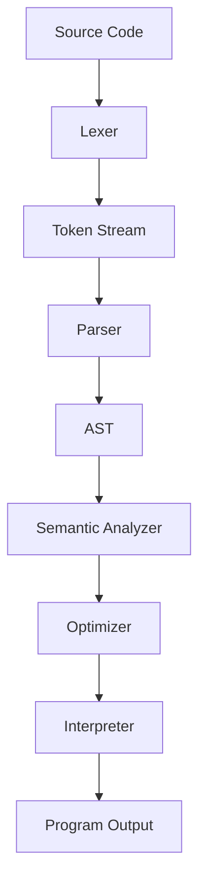

# CodeX Programming Language

**CodeX** is a small educational programming language project that demonstrates
the complete front-end and execution pipeline of an interpreted language.

## Completed Objectives

- **Syntax and grammar**: Defined in `.\LANGUAGE_DESIGN.md` and implemented by the canonical `.\hinagpis.py`.
- **Lexer**: Tokenizes source code into positioned tokens.
- **Parser**: Validates syntax and builds an Abstract Syntax Tree (AST).
- **Semantic analysis**: Checks variables, functions, arity, returns, and basic type mistakes.
- **Interpreter**: Executes CodeX programs.
- **Optimization**: Performs constant folding, constant branch pruning, and dead-code removal after `return`.
- **Error handling/debugging**: Reports lexer, parser, semantic, and runtime errors with line/column information; supports `--debug`.
- **Core constructs**: Variables, data types, arithmetic, conditionals, loops, functions, lists, and built-ins.

## Project Structure

- **`.\hinagpis.py`**: Canonical implementation based on your original SadBoy CodeX lexer and token names.
- **`.\main.py`**: Command-line entry point.
- **`.\hinagpis_ui.py`**: Multiline coding UI / mini IDE.
- **`.\examples\`**: Multiple runnable SadBoy CodeX example programs.
- **`.\test_lexer.py`**: Lexer demonstration suite.
- **`.\LANGUAGE_DESIGN.md`**: Unified guide for syntax, grammar, lexer, parser, semantics, interpreter, optimizer, CLI usage, and SadBoy keywords.

## Run the Demo

```bash
python .\main.py .\examples\08_complete_program.codex
```

Expected output:

```text
loop 0
loop 1
loop 2
sum = 15
factorial(5) = 120
first number type = int
```

## Run the Example Programs

The `.\examples\` folder contains focused examples using the original
SadBoy-style keywords and token names:

- **`.\examples\01_variables.codex`**: Variables and data types.
- **`.\examples\02_arithmetic.codex`**: Arithmetic operations and precedence.
- **`.\examples\03_conditionals.codex`**: `kung`, `o_else`, `at`, and `hindi`.
- **`.\examples\04_while_loop.codex`**: `habang` loop.
- **`.\examples\05_for_loop_lists.codex`**: `para ... sa` loop with lists.
- **`.\examples\06_functions_recursion.codex`**: `gawa`, `balikan`, and recursion.
- **`.\examples\07_index_assignment.codex`**: List indexing and indexed assignment.
- **`.\examples\08_complete_program.codex`**: Complete mini program.

Run one example:

```bash
python .\main.py .\examples\06_functions_recursion.codex
```

Run all examples in PowerShell:

```powershell
Get-ChildItem .\examples\*.codex | ForEach-Object {
    Write-Host "`n--- $($_.Name) ---"
    python .\main.py $_.FullName
}
```

## CLI Usage

```bash
# Run a program
python .\main.py .\examples\08_complete_program.codex

# Print tokens only
python .\main.py .\examples\08_complete_program.codex --tokens

# Parse, semantically validate, and optimize without executing
python .\main.py .\examples\08_complete_program.codex --ast

# Run with interpreter trace
python .\main.py .\examples\08_complete_program.codex --debug

# Start the REPL
python .\main.py
```

## Multiline Coding UI

Launch the desktop editor:

```bash
python .\hinagpis_ui.py
```

The UI supports:

- **Multiline code editing**
- **Run program** with `F5`
- **Validate syntax and semantics** with `Ctrl+Enter`
- **Show lexer tokens**
- **Open and save `.codex` files**
- **Output/error panel**
- **Line numbers**

## CodeX Syntax Example

```codex
func factorial(n) {
    if (n <= 1) {
        return 1
    } else {
        return n * factorial(n - 1)
    }
}

numbers = [1, 2, 3, 4, 5]
sum = 0

for item in numbers {
    sum = sum + item
}

print("sum =", sum)
print("factorial =", factorial(5))
```

## Supported Language Features

- **Data types**: `int`, `float`, `string`, `bool`, `list`, `null`, functions.
- **Arithmetic**: `+`, `-`, `*`, `/`, `//`, `%`, `^`.
- **Comparison**: `==`, `!=`, `<`, `>`, `<=`, `>=`.
- **Logic**: `and`, `or`, `not`.
- **Conditionals**: `if (...) { ... } else { ... }`.
- **Loops**: `while (...) { ... }` and `for item in list { ... }`.
- **Functions**: `func name(a, b) { return a + b }`.
- **Lists**: `[1, 2, 3]`, indexing with `items[0]`, and indexed assignment.
- **Built-ins**: `print`, `len`, `type`, `input`.
- **Original tokens preserved**: Filipino/SadBoy token names such as `KUNG`, `HABANG`, `GAWA`, `BALIKAN`, `DAGDAG`, and `BAWAS` are preserved; English keywords are accepted only as aliases.

## Architecture



## Testing

```bash
python .\test_lexer.py
python .\main.py .\examples\08_complete_program.codex --ast
python .\main.py .\examples\08_complete_program.codex
```

